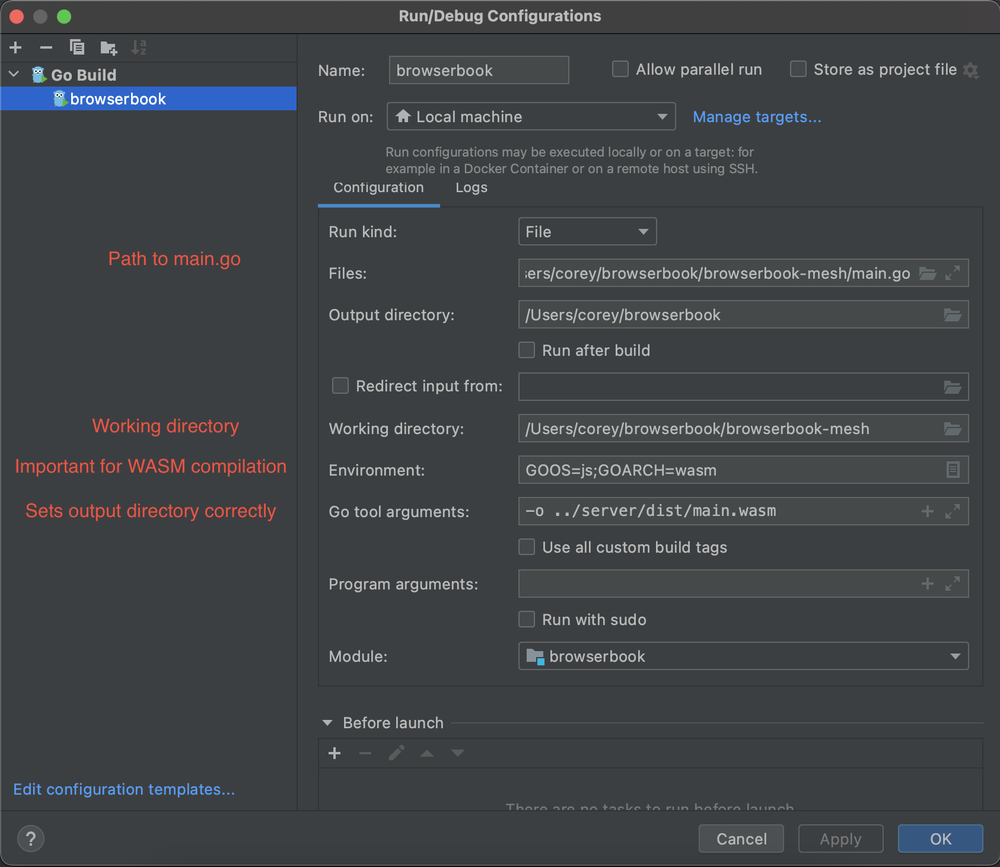
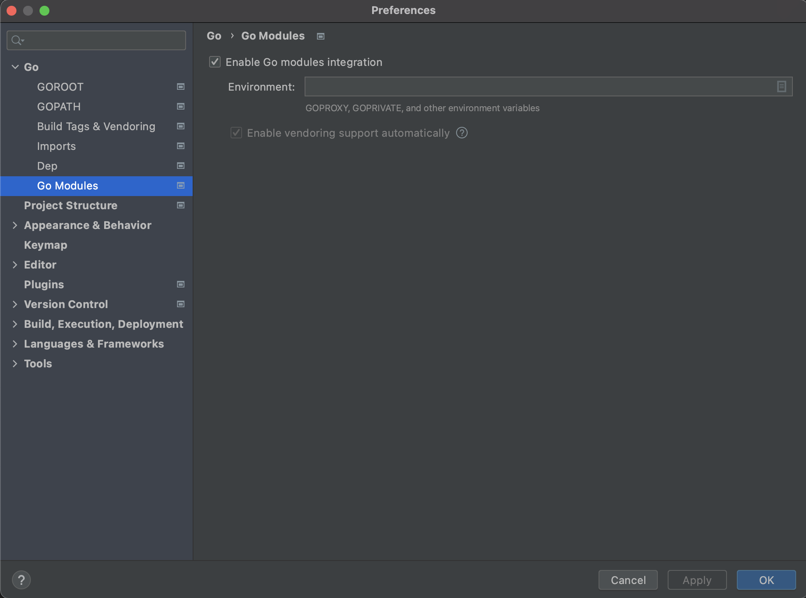

<!-- PROJECT SHIELDS -->
<!--
*** I'm using markdown "reference style" links for readability.
*** Reference links are enclosed in brackets [ ] instead of parentheses ( ).
*** See the bottom of this document for the declaration of the reference variables
*** for contributors-url, forks-url, etc. This is an optional, concise syntax you may use.
*** https://www.markdownguide.org/basic-syntax/#reference-style-links
-->

[![Stargazers][stars-shield]][stars-url]
[![Issues][issues-shield]][issues-url]

<!-- PROJECT LOGO -->
<br />
<p align="center">

  <a href="https://github.com/map-bgp/browserbook">
    
  </a>

  <h3 align="center">Browserbook</h3>

  <p align="center">
      A Decentralized Peer-to-Peer Exchange Powered by WebAssembly
      <br />
      <a href="https://github.com/map-bgp/browserbook"><strong>Explore the docs »</strong></a>
      <br />
      <br />
      ·
      <a href="https://github.com/map-bgp/browserbook/issues">Report Bug</a>
      ·
      <a href="https://github.com/map-bgp/browserbook/issues">Request Feature</a>
  </p>

</p>


<!-- TABLE OF CONTENTS -->
<details open="open">
  <summary><h2 style="display: inline-block">Table of Contents</h2></summary>
  <ol>
    <li>
      <a href="#about-the-project">About The Project</a>
      <ul>
        <li><a href="#built-with">Built With</a></li>
      </ul>
    </li>
    <li>
      <a href="#getting-started">Getting Started</a>
      <ul>
        <li><a href="#prerequisites">Prerequisites</a></li>
      </ul>
    </li>
    <li>
      <a href="#usage">Usage</a>
      <ul>
        <li><a href="#ide-support">IDE Support</a></li>
      </ul>
    </li>
    <li><a href="#component-hierarchy">Component Hierarchy</a></li>
    <li><a href="#testing">Testing</a></li>
    <li><a href="#roadmap">Roadmap</a></li>
    <li><a href="#license">License</a></li>
    <li><a href="#contact">Contact</a></li>
    <li><a href="#acknowledgements">Acknowledgements</a></li>
  </ol>
</details>


## About The Project

Browserbook is a decentralized ethereum exchange powered by the 0x order protocol and WebRTC. Order discovery is
performed asynchronously and without a centralized order book. Instead, clients, or peers, each maintain a copy of the
order book directly, and communicate between each other in order to ensure consistency.
Thanks to the power of WebAssembly, clients can be run directly in the browser, providing a seamless user experience
without the need for complicated dependencies. The front end application, as well as the ensuing WASM binary,
are loaded from the IPFS network, to ensure true decentralization.

### Built With

Browserbook depends on a lot other awesome projects. Much of the backend code relies on the work of the discontinued
mesh-browser project from 0x labs.

* [0xProject](https://github.com/0xProject)
* [Ganache](https://github.com/trufflesuite/ganache)
* [Truffle](https://github.com/trufflesuite/truffle)
* [IPFS](https://github.com/ipfs)

## Getting Started

To get a local copy up and running please read the following.

The overall directory hierarchy resembles the following

```
-- browserbook
   |-- browserbook-mesh
       |-- go.mod
       |-- main.go
       |-- ...
   |-- client
       |-- src
       |-- package.json
       |-- truffle-config.js
       |-- webpack.config.js
       |-- ...
   |-- misc
   |-- oms-go
   |-- server
       |-- dist
       |-- index.js
       |-- package.json
       |-- ...
```

`browserbook-mesh` contains the main golang code that compiles to the wasm binary served to the client

`client` contains the front end application that is bundled and served to the client

`oms-go` is a spike implementation of our more advanced order book features. It is incomplete and will be integrated into `browserbook-mesh` at a later time

`server` is a simple [Express](https://github.com/expressjs/express) application that serves the wasm binary during development. In production this is performed by the IPFS network

### Prerequisites

The project depends on certain prerequisites.

First, ensure that [Node.js](https://github.com/nodejs/node) __v12__ (we use __v12.22.1__) is installed and available to the command line.
We highly recommend using [NVM](https://github.com/nvm-sh/nvm) to manage your node installations.

You will also need to ensure that [golang](https://github.com/golang/go) is installed. The repository has been tested and works with __golang 1.16__.

## Usage
1. Clone the repo

   ```sh
   git clone https://github.com/map-bgp/browserbook.git
   ```

2. Change into browserbook-mesh directory

   ```sh
   cd browserbook/browserbook-mesh
   ```

3. Install go dependencies

   ```sh
   go mod tidy
   ```

4. Compile the wasm binary
   ```sh
   GOOS=js GOARCH=wasm go build -o ../client/src/wasm/main.wasm
   ```

5. Back from the project root, navigate to the client directory

   ```sh
   cd client
   ```

6. Install dependencies and start the Webpack dev server

   ```sh
   npm install && npm run dev
   ```

You should now be able to open a browser and navigate to `http://localhost:8080/`

If you open the console, you should see 0x order activity. Note we do not recommend Safari.

### IDE Support

If you would like to run the project via a modern IDE, some appropriate configuration needs to be set.

For example, if using Goland, your configuration would need to look like this:



You also need to enable module support if using Goland:



## Component Heirarchy

This section will be completed at a later time

## Testing

```sh
TBD
```

## Roadmap

TBD

Please see the [open issues](https://github.com/map-bgp/browserbook/issues) for a further list of proposed features (and known issues).

## License

Distributed under the Apache v2 License. See `LICENSE` for more information.

## Contact

This implementation is the work of Corey Bothwell, Ankan Gosh, and Saiteja Reddy Pottanigari.

They can be reached via their respective GitHub accounts.

Project Link: [https://github.com/map-bgp/browserbook](https://github.com/map-bgp/browserbook)

## Acknowledgements

* [University of Zurich Institut for Informatik CSG](https://www.csg.uzh.ch/csg/en/)

<!-- MARKDOWN LINKS & IMAGES -->
<!-- https://www.markdownguide.org/basic-syntax/#reference-style-links -->

[stars-shield]: https://img.shields.io/github/stars/map-bgp/browserbook.svg?style=plastic

[stars-url]: https://github.com/map-bgp/browserbook/stargazers

[issues-shield]: https://img.shields.io/github/issues/map-bgp/browserbook.svg?style=plastic

[issues-url]: https://github.com/map-bgp/browserbook/issues

[license-shield]: https://img.shields.io/github/license/map-bgp/browserbook.svg?style=plastic

[license-url]: https://github.com/map-bgp/browserbook/blob/master/LICENSE.txt
